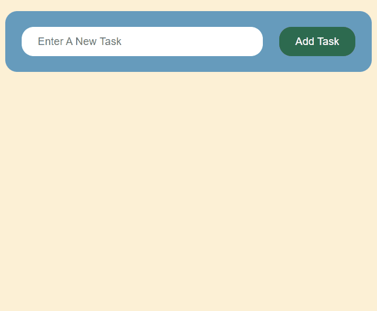

# CRUD Firebase Todo Web App

This is a todo list web application using firebase as a database.

## 🔗 Links

## 🛠 Languages and Tools
- JavaScript
- HTML
- CSS
- Firebase

## Screenshots

## Future Updates

[ ] Authentication
